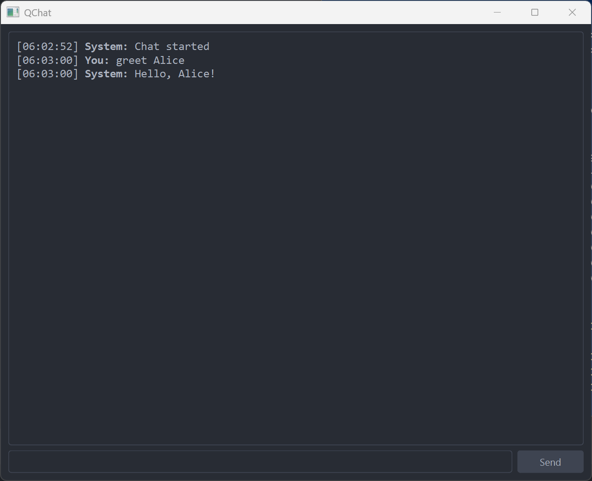

# QChat - Instant GUI for Python Functions

Turn functions into chat commands with 1 LOC. no boilerplate.

Just add @qchat.command("YourCommand") to your function, and it's ready to go. QChat will automatically convert your function into a chat command, and you can call it from the chat interface.

## A Simple Example

```python
import qchat

@qchat.command("greet")
def greet(name: str):
    """Greet a user"""
    return f"Hello, {name}!"

if __name__ == "__main__":
    qchat.run()

```



## Features

- 🎨 **QT6-based UI**: Modern, customizable chat interface
- ✨ **Command Decorators**: Easily turn functions into chat commands
- 🔄 **Auto Type Conversion**: Automatic argument type conversion
- 📚 **Built-in Help**: Auto-generated help system
- 🚀 **Lightweight**: Minimal dependencies

## Installation

### Prerequisites

- Python 3.8+
- pip

### Setup

```bash
pip install qchat
```

## Advanced Features
Type Conversion:

```python
@qchat.command("add")
def add_numbers(a: int, b: int):
    """Add two numbers"""
    return f"Result: {a + b}"
```

Variable Arguments:

```python
@qchat.command("echo")
def echo_message(*args):
    """Echo back the input"""
    return " ".join(args)
```

HTML Output:

```python
@qchat.command("html")
def cmd_html():
    "Demo of HTML output"
    return """<h1>HTML Demo</h1>
    <p>This is a paragraph of text.</p>
    <p>It can contain <strong>bold</strong> and <em>italic</em> text.</p>
    """
```

Built-in Help:

```python
@qchat.command("help")
def cmd_help():
    "Show available commands"
    return qchat.show_help()
```

## Hacking on QChat

install pyside6 with the following command:

```bash
pip install pyside6
```

update the ui file and convert it to python code with the following command:

```bash
pyside6-uic.exe .\main_window.ui -o .\main_window.py
```

### License
MIT License. See LICENSE for details.